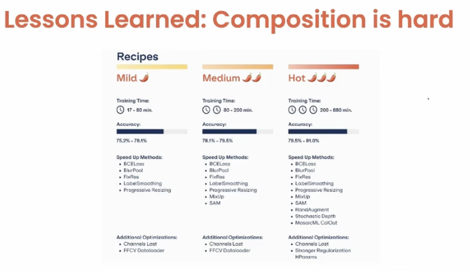
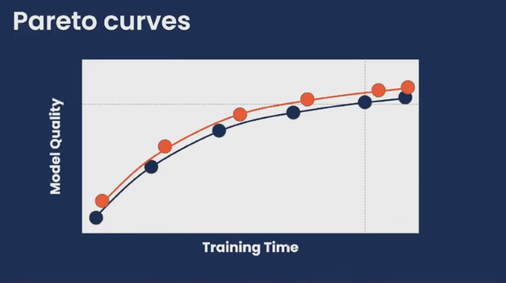
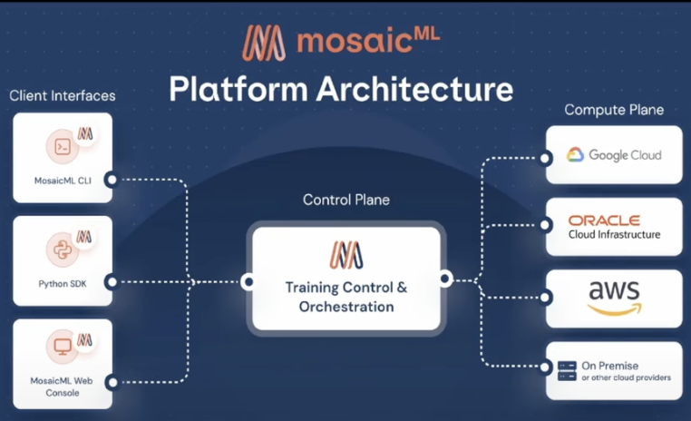

# Reducing friction for AI Model Training: MosaicML's Journey to Acquisition by Databricks

The challenges associated with training large models have been a growing concern, both in terms of time and cost. Recently, David Blalock, a founding engineer at MosaicML, shed light on their remarkable journey in a captivating [YouTube video](https://www.youtube.com/watch?v=aLh5DxGl4iI&t=5s), where he detailed the company's acquisition by Databricks for a staggering $1.3 billion. In this article, I wanted to summarize the talk and delve into the technical aspects of their approach and explore the key takeaways from their success story.

## The Challenge: Escalating Training Costs

As AI models grow in complexity and size, the cost of training them has been rising dramatically—upwards of 200-400% YoY. The team at MosaicML identified that addressing these escalating costs can be tackled with algorithmic changes in Software.

## The Optimization Approach

MosaicM scrutinized architectural changes, which revealed potential gains ranging from 10-30%. However, this avenue comes with its own challenges, including the high costs and time involved in developing new hardware chips. 

Another optimization arena was in compilers. Tweaking libraries such as cuDNN, ROC XLA, and OpenAI Triton showed promise, delivering improvements of around 30%. These enhancements often revolved around swapping optimized kernels and fusing operations.

Yet, the real breakthrough emerged when MosaicML decided to focus on software-driven algorithmic advances. The key idea was to reshape workloads to attain a more favorable Pareto curve. Their central question: Could they achieve equivalent model performance in less time and at a reduced cost?

## Transforming Training

Delving into the technical details, Blalock highlighted MosaicML's approach on handling algorithmic changes mentioned across various research papers. One such advancement was the integration of Blurpool (This technique is drawn from the "making convolutions shift invariant again" paper) and combining it with Selective backpropagation which utilizes only samples with significant loss during backpropagation.

## Implementation Strategies: From Model Surgery to API Magic

To realize these algorithmic changes, two implementation approaches can be adopted. The first method involved manually altering the class definitions of models, essentially swapping layers to incorporate techniques like Blurpool and selective backpropagation. While effective, this method posed challenges in terms of user-friendliness and issues with debugging.

A more elegant solution surfaced in the form of an API, aptly named [MosaicML Composer](https://github.com/mosaicml/composer). The team adopted an aspect-oriented programming approach, enabling seamless integration of technique swaps through structured callbacks. Drawing inspiration from the Fast ai approach, this method offered a smoother user experience and facilitated experimentation with different optimizations with ease.

## The Power of Synergy: Small Changes, Big Impact

A pivotal insight shared by Blalock was the cumulative effect of combining multiple algorithmic changes. While individually these optimizations seemed incremental, their collective impact was profound. MosaicML's success story underscored the potential of synergy—how seemingly minor changes, when strategically interwoven, could lead to a remarkable overall improvement.

While hardware advancements hold their own place in the AI landscape, algorithmic innovations can wield substantial power. Blalock noted that just a few years of dedicated research could yield up to a 7x improvement, surpassing the scale of similar gains achieved through hardware modifications.

# Orchestrating Cloud Training: The MosaicML Solution

With the shift in focus, MosaicML worked on a server-side infrastructure that orchestrated model training on the cloud. They confronted a series of challenges mentioned below:

1. Determinism in Training: MosaicML recognized the importance of ensuring training determinism despite potential server-side failures. While achieving bit-level determinism was complex, they provided sufficient level of determinism. Additionally they provided elastic determinism. This ensured that even when reconfiguring the number of training nodes, the system maintained stability, catering to dynamic cloud environments.

2. Hardware Fault Tolerance: Training models on a cloud infrastructure meant dealing with hardware variations. MosaicML tackled this by developing mechanisms to ensure fault tolerance in hardware, ensuring consistent performance across different nodes and configurations.

3. Orchestrating Cloud Components: MosaicML's innovation extended beyond the model itself to include the orchestration of components, ensuring a seamless training process that minimized downtime and inefficiencies.

4. Streaming Data Efficiency: To address the challenge of handling massive datasets, MosaicML introduced a smart solution: streaming data to local machines for training instead of downloading terabytes of data. This strategy improved efficiency, reducing data transfer times. Additionally, they maintained pseudo-randomization for local training data, enhancing the training process's effectiveness.

# The ChatGPT Boost
One of the intriguing aspects of MosaicML's journey is its alignment with the ascent of ChatGPT. The surge in AI model popularity, fueled by impressive capabilities and user engagement, played a significant role in propelling MosaicML's solution into the limelight. As users increasingly turned to AI models for a wide range of tasks, the demand for optimized training solutions skyrocketed. MosaicML's model orchestration capabilities perfectly complemented this trend, further driving their success.

# Conclusion

Technical challenges tackled by MosaicML
1. Implementation of composition (algorithmic changes) 
2. handing distributed systems for training. 

Takeaways:
1. small wins make a big win.
2. something kinda works is much much different than something that "just works".

# interesting snapshots

